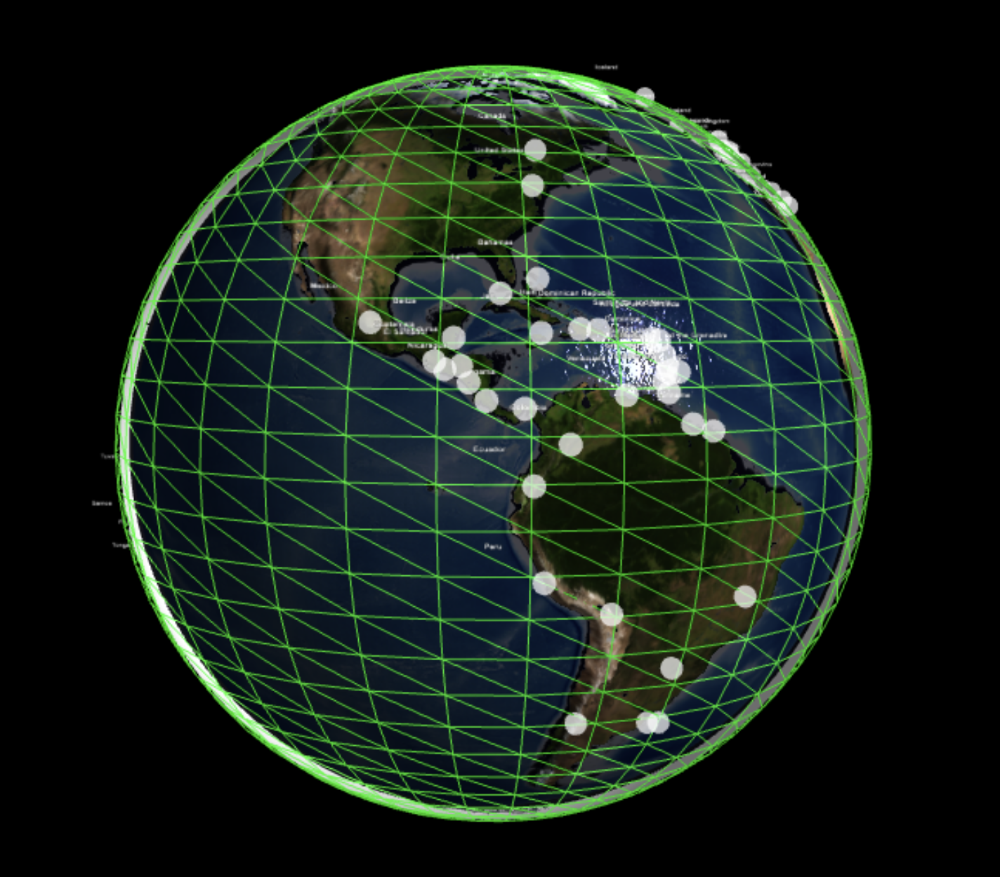

# GlobeNews: Interactive 3D World News Explorer


## Overview

GlobeNews is an innovative web application that combines 3D visualization with real-time news aggregation. It offers users an engaging way to explore global news by interacting with a 3D model of Earth.

## Key Features

- Interactive 3D globe rendered using Three.js
- Real-time news fetching for countries worldwide
- Responsive design for seamless desktop and mobile experiences
- Efficient country detection using reverse geocoding
- Sleek, modern UI with intuitive user interactions

## Technical Highlights

### 3D Globe Rendering
- Utilizes Three.js for high-performance 3D graphics
- Custom shader implementation for realistic Earth representation
- Optimized triangulation process for smooth rendering

### Dynamic News Fetching
- Asynchronous API calls for real-time news updates
- Backend built with Node.js and Express
- Integration with external news APIs (e.g., NewsAPI, GNews)

### Frontend Architecture
- Built with React for efficient UI updates and component reusability
- State management using React Hooks and Context API
- Responsive design implemented with CSS Grid and Flexbox

### Performance Optimization
- Lazy loading of news content for faster initial page loads
- Efficient memory management to handle large datasets
- Caching strategies to reduce API calls and improve response times

## Code Samples

### Globe Creation
```javascript
function createGlobe(radius, detail) {
    const geometry = new THREE.IcosahedronGeometry(radius, detail);
    const material = new THREE.MeshPhongMaterial({
        map: THREE.ImageUtils.loadTexture('assets/earth-texture.jpg'),
        bumpMap: THREE.ImageUtils.loadTexture('assets/earth-bump.jpg'),
        bumpScale: 0.05,
        specularMap: THREE.ImageUtils.loadTexture('assets/earth-specular.jpg'),
        specular: new THREE.Color('grey')
    });
    return new THREE.Mesh(geometry, material);
}
```

## Triangulation Process
The 3D globe in our application is created using a process called triangulation. This method involves breaking down the sphere's surface into a network of triangles, which allows for efficient rendering and manipulation in 3D space.


*Figure: Visualization of the sphere triangulation process*


## How it works:
Icosahedron Base: We start with an icosahedron, a 20-sided polyhedron, as our base shape.
Subdivision: Each face of the icosahedron is subdivided into smaller triangles. This process is repeated several times to increase the resolution of our sphere.
Spherification: The vertices of the resulting mesh are then projected onto the surface of a sphere, creating our globe shape.
Optimization: The triangles are optimized to ensure even distribution and smooth rendering across the globe's surface.
UV Mapping: Each vertex is assigned UV coordinates, allowing us to accurately map our Earth texture onto the sphere.


### Running the Project
1. Clone the repository
2. Install dependencies: npm install
3. Set up environment variables (API keys)
4. Run the development server: npm run dev
5. Open http://localhost:3000 in your browser
